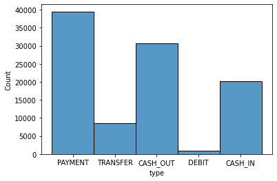
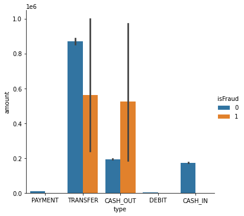
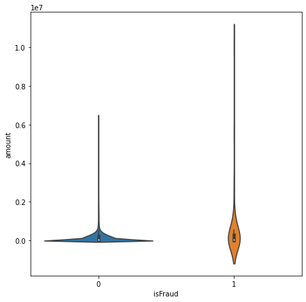

# Fraud Detection

<i>Fraud detection is a set of activities undertaken to prevent money or property from being obtained through false pretenses. Fraud detection is applied to many industries such as banking or insurance. In banking, fraud may include forging checks or using stolen credit cards. Other forms of fraud may involve exaggerating losses or causing an accident with the sole intent for the payout.

Organizations should look for fraud in financial transactions, location, devices used, initiated sessions and authentication systems.</i>

# 1. Data

There is a lack of public available datasets on financial services and specially in the emerging mobile money transactions domain. Financial datasets are important to many researchers and in particular to us performing research in the domain of fraud detection. Part of the problem is the intrinsically private nature of financial transactions, that leads to no publicly available datasets.The data used in this problem is synthetic dataset using the simulator called PaySim as an approach to such a problem. PaySim uses aggregated data from the private dataset to generate a synthetic dataset that resembles the normal operation of transactions and injects malicious behaviour to later evaluate the performance of fraud detection methods.

PaySim simulates mobile money transactions based on a sample of real transactions extracted from one month of financial logs from a mobile money service implemented in an African country. The original logs were provided by a multinational company, who is the provider of the mobile financial service which is currently running in more than 14 countries all around the world.

https://www.kaggle.com/ealaxi/paysim1

## 2. Method

Identifying fraudulent transactions can be tackled using algorithms from any of the 3 methods listed below:
    
<b>Supervised Learning</b>:  I considered Logistic Regression and Random Forest because of the impretability of Logistic regression and the power of ensemble which Random forest provides.  

<b>Semi-supervised Learning</b>: Due to the highly imbalanced nature of the datset it is imperative to handle that for which I looked at using K-Means to train the data and get clusters equivalent to the number of data points in the minor(fraudulent) class. This approach gave good results when the generated clusters or the dataset had few transactions which were fraudulent hwoever it became impratical to train around 6million transactions andn generate upwards 7K clusters just for the sake of handling class imbalance    

<b>Anomaly Detection</b>: I looked at the Isolation Forest algorithm to frame this problem as an anomaly detection problem. However, the results were poor with totally unseen/production data. 
https://en.wikipedia.org/wiki/Isolation_forest

>  *I chose to work on supervised learning algorithms. Looking at the volume of the transactions, it made sense to choose algorithms which will be quicker to train and would be interpretable*

## 3. Data Wrangling

The data received is almost clean and only basic wrangling steps were needed to make it available for EDA. In this problem, I type casted the data correctly, checked & deleted *(if any)* duplicate data points existed

## 4. Exploratory Data Analysis

> Most number of transactions occur in Transaction Type:'Payment', however most of fraudulent transactions happen in Transaction Type:'Transfer' and the fraudulent amount is exponentially higher to non-fraudlent transations

## 4. Pre-processing

> One hot Encoding: For the transaction types one hot encoding is used

> Feature Extraction: Few functions/methods are created for feature generation/extration

# 5. Machine Learning Approach

- Limiting the number of non fraudulent transactions from the dataset in order to make the extreme class imbalance (1:1000) to an imbalance of lower order.
- Splitting of data into train,test
- Logistic Regression with Grid Search
- RandomForestClassifier with Randomized Search

- Solving for the imbalance in dataset
    - SMOTE
        - Using SMOTE for oversampling of the data
- Testing results using totally unseen data to understand how the model would perform in a production setup

#### Metrics Used:
- Precision
- Recall
- Roc Auc Score
    

## 6. Model Selection and Results

### Without handling class imbalance
| Model | Precision | Recall | Precision - Unseen data | Recall - Unseen data |
| --- | --- | --- | --- | --- |
| Logistic Regression | .19 | .977 | .07 | .977 | 
| Random Forest | .45 | .972 | .21 | .983 |

### Applying SMOTE
| Model | Precision | Recall | Precision - Unseen data | Recall - Unseen data |
| --- | --- | --- | --- | --- |
| Logistic Regression | .87 | .985 | .06 | .977 | 
| Random Forest | .97 | .997 | .24 | .993 | 

 ***Random forest after applying SMOTE technique performs best amongst all models***
    
## 7. Future Improvements

- I would like to change the performance metric to a weighted F1 score with incline towards Recall
- Explore other algorithms to get a precision score
